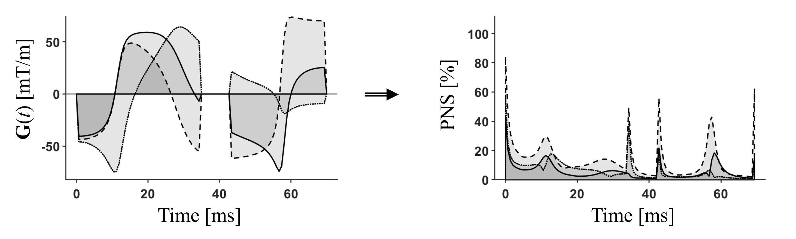

## Prediction of PNS in Siemens MRI systems (SAFE model)

Filip Szczepankiewicz (filip.szczepankiewicz@med.lu.se) and Thomas Witzel  

Medical Radiation Physics
Lund University, Sweden

Brigham and Women's Hospital, MA, Boston  
Harvard Medical School, MA, Boston  
Massachusetts General Hospital, MA, Boston  


#### Additional contributions
* Thanks to Maxim Zaitsev for debugging/validating the "1/pi error" as well as for the Java-based SHA code (which replaces the .NET implementation).

### Scope
This code aims to use the SAFE model to predict PNS in Siemens MRI systems based on any given hardware configuration defined by MP_GPA*.asc files. This code may not be accurate, and results should be interpreted with care!

**Note** that hardware specifications are confidential and are **not shared as part of this repository**! These
parameters must be supplied by the user (as described below) or be requested on the [MAGNETOM forum](https://www.magnetom.net/t/safe-peripheral-nerve-stimulation-prediction-in-matlab/4681).

### How to extract system specific SAFE model parameters
Paramters that are relevant to the SAFE model prediction are found in "measurement parameter" files, which can be found on the scanner host or in the IDEA simuation environment (...\n4\pkg\MrServers\MrMeasSrv\Config\InitMeas\ or ...\MIDEA\NX***\Config\MriProduct\Measurement\InitMeas\). These .asc files have names starting with "MP_GPA_", the rest of the file name depends on the gradient system. The gradient system name can be found by calling ```imprint``` at the scanner console. More details are provided via the [MAGNETOM forum](https://www.magnetom.net/t/safe-peripheral-nerve-stimulation-prediction-in-matlab/4681).

In the framework provided herein, the relevant parameters are read from the .asc file to the hardware structure (```hw```) by the function ```hw = safe_hw_from_asc(...)```.  

You can also create the hardware structure manually and check if you filled in the numbers correctly by calling ```safe_hw_verify(hw)```.  

An example of the hardware structure format can be found in ```safe_example_hw``` and an end-to-end example script can be found in ```safe_example```.

### Reference
If you use these resources, please consider citing:  
[_F. Szczepankiewicz, C-F. Westin, M. Nilsson. Gradient waveform design for tensor-valued encoding in diffusion MRI._ Journal of Neuroscience Methods 348, 2021. https://doi.org/10.1016/j.jneumeth.2020.109007](https://www.sciencedirect.com/science/article/pii/S0165027020304301)  

The PNS prediction is based on the SAFE model by Herbank and Gebhardt (ISMRM abstract):  
[SAFE-Model - A New Method for Predicting Peripheral Nerve Stimulations in MRI
by F.X. Herbank and M. Gebhardt. Abstract No 2007. Proc. Intl. Soc. Mag. Res. Med. 8, 2000, Denver, Colorado, USA](https://cds.ismrm.org/ismrm-2000/PDF7/2007.PDF)

### Example figure


The example gradient waveform yields spherical diffusion encoding, and taken by itself (ignoring the imaging gradients and the readout) it causes approximately 80% of the allowed PNS, i.e. we predict that this waveform does not exceed the PNS limit. However, it should be analyzed together with the EPI waveform to detect potential interactions between the two.  

### Related resources can be found at the [FWF sequence GIT repository](https://github.com/filip-szczepankiewicz/fwf_seq_resources)
